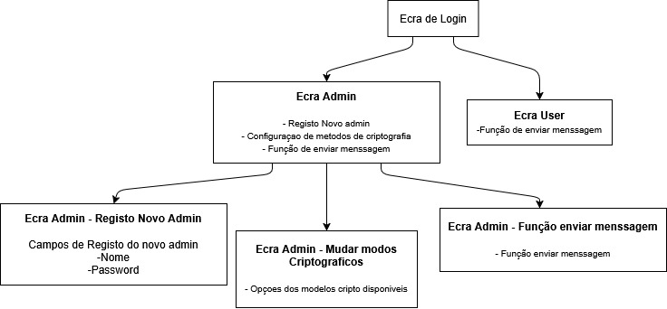

# Projeto – Implementação de uma VPN

Este projeto tem como objetivo implementar e emular uma **Rede Privada Virtual (VPN) simplificada**, usando uma ligação TCP como intermediária entre dois clientes UDP. Para além disso, integra métodos de criptografia configuráveis por um administrador autenticado.

## Arquitetura Geral

A VPN é composta por:

* **ProgUDP1**: Cliente UDP 1
* **ProgUDP2**: Cliente UDP 2
* **VPN Client**: Cliente intermediário que liga ao servidor por TCP
* **VPN Server**: Servidor central que intermedeia a comunicação entre os dois clientes UDP

## Funcionalidades Implementadas

* Encaminhamento de mensagens UDP através de túnel TCP
* Criptografia simétrica usando **Cifra de César Generalizada**
* Troca de chaves por **algoritmo Diffie-Hellman**
* Interface de administração:

  * Registo de novos administradores
  * Configuração de métodos criptográficos
  * Envio de mensagens
* Interface de utilizador comum:

  * Envio de mensagens

## Diagrama de Interfaces



## Requisitos

* Python 3.10 ou superior
* Bibliotecas:

  * `socket`
  * `threading`
  * `hashlib`
  * `random`

## Como correr o projeto

1. **Clonar o repositório:**

   ```bash
   git clone https://github.com/diogoJsaraiva/Criptologia.git
   cd Criptologia
   ```

2. **Abrir 3 terminais separados e correr:**

   * Terminal 1: **Servidor TCP (VPN Server)**

     ```bash
     python vpn_server.py
     ```

   * Terminal 2: **Cliente VPN (VPN Client)**

     ```bash
     python vpn_client.py
     ```

   * Terminal 3: **Cliente UDP 1 ou 2**

     ```bash
     python prog_udp1.py
     # ou
     python prog_udp2.py
     ```
    ---

    ## Como correr esta versão dos Menus

    1. **Abre 3 terminais na pasta do projeto.**

    2. **No primeiro terminal, corre o servidor UDP (ProgUDP2):**
        ```bash
        python udp/prog_udp2.py
        ```

    3. **No segundo terminal, corre o servidor VPN:**
        ```bash
        python vpn/vpn_server.py
        ```

    4. **No terceiro terminal, corre o menu principal (autenticação, menus, envio):**
        ```bash
        python main.py
        ```

    - **Ao iniciares o `main.py`, vais ver o ecrã de login.**
        - Usa o utilizador padrão na primeira execução:
          - **Username:** `admin`
          - **Password:** `admin123`
    - **Se entrares como admin:**
        - Podes criar novos utilizadores (admin ou user)
        - Alterar o método de cifra (Caesar Cipher, podes definir o shift)
        - Enviar mensagens (vão cifradas via VPN)
    - **Se entrares como user:**
        - Só podes enviar mensagens


3. **Interação Admin/User:**

   * Após login, o utilizador será redirecionado para o ecrã adequado (Admin ou User).
   * O Admin pode:

     * Registar novos administradores
     * Mudar os modos de criptografia
     * Enviar mensagens criptografadas
   * O User apenas tem acesso ao envio de mensagens

## Estado do Projeto

* Encaminhamento de mensagens UDP
* Criptografia Cifra de César + Diffie-Hellman
* Interface de login e distinção Admin/User
* Configuração de métodos criptográficos

## Organização por fases (conforme especificação IPG)

* **Fase 1:** Mockups, interfaces, menus, registo de admins 
* **Fase 2:** Criptografia simétrica, hash, configuração de parâmetros 
* **Fase 3:** Registo em estrutura imutável (blockchain), GUI avançada 

## Autores

Desenvolvido no âmbito da UC de Criptologia – Instituto Politécnico da Guarda (IPG)
2024/2025
